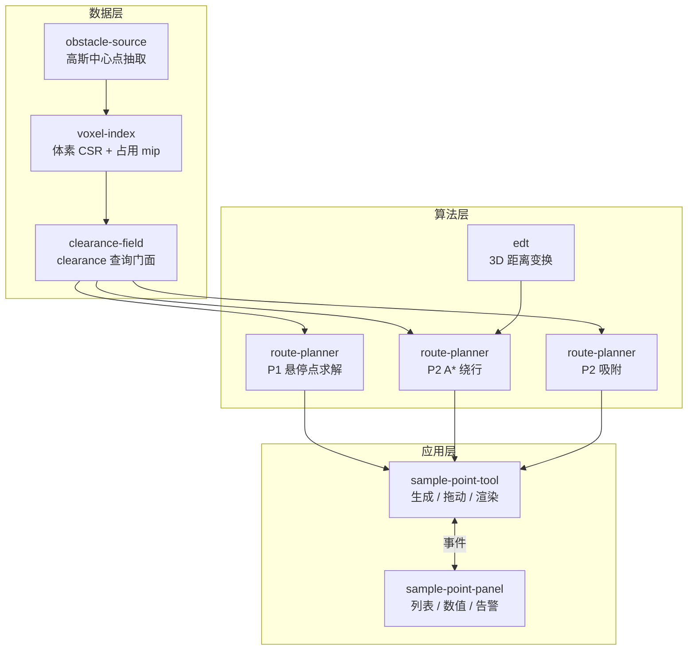

# 航点/航线避障规划 — 需求与实现文档

> 版本：1.0（对应当前工作区未提交代码）
> 日期：2026-09-09
> 模块：SuperSplat 采样点标记与无人机航线规划
> 状态：P0 / P1 / P2 已实现，P3 未开始

---

## 1. 背景与目标

### 1.1 要解决的问题

原实现「采样点 + 相机方向近似法线 × 固定偏移」生成悬停点，再用直线依次连接，存在三类致命缺陷：

| 缺陷 | 后果 |
|------|------|
| 法线取自「表面点 → 相机」方向 | 从设备背面标注时，悬停点落在背面；换个视角重新生成位置就变 |
| 固定偏移不校验 | 偏移落点可能撞到相邻设备 |
| 航段是纯直线 | 两个悬停点在设备两侧时，连线必然横穿设备本体 |

### 1.2 目标

在导入的 LCC 高斯泼溅场站模型上，生成**可证明不与模型相交、并留出安全裕度**的悬停点与航线。

### 1.3 「绝对安全」的边界（必须先对齐）

| 能做到 | 做不到 |
|--------|--------|
| 在给定重建模型 + 给定裕度下，数学上保证航线与模型点集的最小距离 ≥ N 米 | 模型本身缺失/未扫到的部分无法避 |
| 对导线、避雷针等薄结构用**膨胀 + 大裕度**兜底 | 高斯泼溅的飞点/漂浮噪点会造成假障碍或假空隙 |
| 保证不进入用户框定的禁飞区 | 动态障碍（人、车、吊车、树枝）不在模型里 |
| 导出前可全量复检 | 真实飞行的定位误差、RTK 漂移、风扰 |

**工程定义**：绝对安全 = 保守模型 + 保守裕度 + 全量验证 + 失败即拒绝。

### 1.4 既定策略（已确认）

| 决策项 | 选择 |
|--------|------|
| 无解航点 | **不生成 + 告警**（宁缺勿撞） |
| 拖动到危险区 | **自动吸附**，不可达则回弹 |
| 航段穿模 | P2 自动绕行重规划 |
| 航线结构 | P3 再做起降/巡航垂直分层（未实现） |

---

## 2. 总体架构



**分层职责**

- **数据层**：把高斯点云变成可 O(1)~O(log n) 查询的「离最近障碍有多远」的场
- **算法层**：在场上做搜索与规划，输出安全几何
- **应用层**：交互、渲染、列表与告警；**不夹带安全判定逻辑**

---

## 3. 障碍场（所有判定的地基）

### 3.1 障碍点抽取 `src/route/obstacle-source.ts`

以高斯中心点作为障碍物，过滤两类不应当成实体的点：

- 已删除的高斯（`state & State.deleted`）
- 不透明度 `sigmoid(opacity) < opacityThreshold`（默认 0.15）的飞点/雾状噪声

输出世界坐标 `Float32Array`（xyz 紧凑）。分块（每 262144 点）`setTimeout` 让出主线程，构建期间 UI 不冻结。

### 3.2 空间索引 `src/route/voxel-index.ts`

- **CSR 桶排序**：点 → 体素 → `cellStart` / `cellItems`，O(n) 构建
- **占用 mip 金字塔**：逐级 2× 降采样，直到收敛为单格
- **查询**：DFS 分支限界，用「格 AABB 距离」剪枝，子节点按距离倒序压栈（最近优先），**返回精确点到点距离**（非体素量化值）
- **体素自适应**：默认 0.5 m；格数超过 `maxCells`（400 万）时自动按 1.5× 放大，防止大场景爆内存
- 附带 `forEachPoint` / `forEachWithin`（供绕行播种与法线邻域使用）

### 3.3 查询门面 `src/route/clearance-field.ts`

| 方法 | 说明 |
|------|------|
| `clearance(p)` | 到最近障碍的距离，按 `maxClearance` 截断；场不可用时返回 -1 |
| `nearestObstacle(p, out)` | 同上，并把最近障碍点坐标写入 `out`（用于 3D 指示线） |
| `segmentMinClearance(a, b)` | 按 `segmentStep` 扫掠线段，返回最差点与位置 |
| `levelOf(p)` / `level(c)` | 距离 → 安全等级 |
| `gradient(p, out)` | clearance 场梯度（P2 吸附备用） |

**按需构建 + 版本缓存**：`ensureBuilt(scene)` 先算廉价指纹 `obstacleVersion`（splat 数量 / 删除数 / 世界变换），一致则直接复用。

**失效**：`main.ts` 监听 `scene.clear`、`scene.elementAdded/Removed`、`splat.stateChanged/moved/replaced/positionsChanged` 调用 `invalidate()`。

---

## 4. 安全模型

### 4.1 核心判据

```
hardClearance = droneRadius + safetyMargin
安全 ⇔ clearance(p) ≥ hardClearance
```

当前默认：`droneRadius 0.5 + safetyMargin 1.0 = 1.5 m`（`safetyMargin` 由使用方调整，改这一处即全局生效）。

### 4.2 分级（已按需求简化为两档）

| 等级 | 条件 | 航点颜色 | 距离线颜色 |
|------|------|----------|------------|
| `safe` | clearance ≥ hardClearance | 蓝 `(0, 0.5, 1)` | 蓝 |
| `danger` | clearance < hardClearance | 红 `(1, 0.15, 0.1)` | 红 |
| `unknown` | 场不可用（-1） | 蓝 | 不绘制 |

> 原有的 `warn` 预警档已按需求移除。

### 4.3 参数表 `src/route/safety-config.ts`

| 参数 | 默认值 | 含义 |
|------|--------|------|
| `droneRadius` | 0.5 | 机体半径（含桨叶） |
| `safetyMargin` | 1.0 | 安全裕度 |
| `opacityThreshold` | 0.15 | 低于此不透明度视为飞点 |
| `voxelSize` | 0.5 | 目标体素边长 |
| `maxCells` | 4000000 | 体素上限（内存保护） |
| `maxClearance` | 12.0 | 距离截断（须 > hardClearance） |
| `segmentStep` | 0.25 | 航段扫掠步长 |
| `maxSegmentSamples` | 400 | 单段采样上限 |
| `hoverDistance` | 3.2 | 悬停点偏好距离 |
| `normalRadius` | 0.4 | 法线邻域半径 |
| `normalMinPoints` | 12 | 法线所需最少邻域点 |
| `capAngleDeg` | 60 | 搜索球冠半角 |
| `distanceScales` | [0.6, 0.8, 1.0, 1.3] | 距离搜索档位（× hoverDistance） |
| `minDistance` / `maxDistance` | 1.0 / 20.0 | 搜索距离绝对边界 |
| `sightClearance` | 0.5 | 视线通道最小间距 |
| `searchDirections` | 96 | 球冠采样方向数 |
| `detourCell` | 1.0 | 绕行栅格边长 |
| `detourMaxCells` | 250000 | 绕行栅格上限 |
| `snapMaxDistance` | 6.0 | 吸附最大推移距离 |
| `snapStep` | 0.25 | 吸附推移步长 |

---

## 5. 功能点清单

### 5.1 P0 — 只读校验与可视化（已实现）

不改变任何位置，只测量与呈现，先把风险量化出来。

| 功能 | 说明 |
|------|------|
| 航点测量 | 每个悬停点查一次 clearance，按等级着色（蓝/红） |
| 航段测量 | 沿规划后的折线逐段扫掠，统计最小值（**不参与危险判定**，见 4.2 说明） |
| 3D 距离指示线 | 每个航点画一条到最近模型点的线段 + 端点锚点小球，绘制在 `ToolOverlay` 层，**穿模可见** |
| 面板数值 | 每行显示实测间距；底部汇总「最小间距 x.xx m · 危险航点 N 处（要求 ≥ x.x m）」 |
| 面板长度条 | 量程 0 → 2×hardClearance，白线刻度 = 安全线；悬停显示完整说明 |
| 手动重测 | 航点区标题盾牌按钮 → `route.safety.request`（强制重建场并复测） |

### 5.2 P1 — 悬停点自动求解（已实现）

替代「法线 × 固定偏移」的盲推。

1. **真实法线**：邻域高斯点 PCA（协方差最小特征向量，用 `(trace·I − C)` 幂迭代求解），点不足时半径逐级加倍，仍不足才回退到相机方向法线
2. **朝向消歧**：比较法线两侧的 clearance，朝开阔侧
3. **候选搜索**：法线 ±60° 球冠内 96 个 Fibonacci 方向 × 4 档距离
4. **硬性过滤**
   - clearance ≥ hardClearance
   - **视线可达**：悬停点到采样点的连线前 85%（避开目标点本身，它贴在表面上）全程 ≥ `sightClearance`
5. **打分**：`min(c, 2·hard) − 偏角·hard·0.5 − |d − hoverDistance|·0.5`，取最大
6. **兜底**：沿法线从 `minDistance` 逐步外推到 `maxDistance`
7. **无解**：不生成该航点 → 触发 `route.unsolvable`，面板采样点行标红 + 悬停提示，控制台 warn

### 5.3 P2 — 航段绕行 + 拖动吸附（已实现）

**绕行 `planDetour(a, b)`**

```
直连安全 → 返回 []（不插点）
不安全 → 局部栅格 → 障碍点播种 → EDT 距离场
        → 自由格判定（阈值 = hard + 半格对角线√3/2·cell，保守偏置）
        → 26 邻域 A*（二叉堆，启发式 = 欧氏距离）
        → 视线剪枝压缩（shortcut）
找到 → 返回中间点数组；找不到 → null（保持直连）
```

- 栅格范围 `max(8 m, 30% 航段长)`，保证能翻越/绕开比航段更高的结构
- 中间点只进航线几何，不进面板列表，保证可编辑航点列表干净
- 拖动航点后自动重规划相邻航段

**吸附 `snapToSafe(p)`**

拖完若落入危险区，沿「远离最近障碍」方向以 `snapStep` 步进推送，上限 `snapMaxDistance`；推不出去则**回弹到拖动前位置**。

### 5.4 采样点列表编辑（已实现）

| 功能 | 说明 |
|------|------|
| 行内"＋"下拉 | 每行删除按钮左侧"＋"，点击展开「在此点之前插入 / 在此点之后插入」（共用 `MenuPanel`，挂 `body`，`z-index: 100`） |
| 按位置插入 | `splice` 插入 + `appendBefore` 定位 DOM + 自动重排序号 |
| 连续标注 | 后续点依次排在后面，符合标注顺序 |
| 插入提示 | 目标行绿色高亮 + 提示「下一个采样点将插入到此点之前」 |
| 空文件夹占位 | 「＋ 新增第一个采样点」，解决空列表无处可点 |
| 撤销/重做同步 | 撤销删行（保留实体供重做）、重做插回原位（`insertIndexByMarker`） |
| 航点失效提示 | 采样点增删后显示「采样点已变更，请重新生成航线」，重新生成后消失 |
| 点击定位 | 点击行 → 相机平滑飞到该点（已有缩放更近则保持当前视距） |

---

## 6. 事件契约

| 事件 | 方向 | 数据 | 说明 |
|------|------|------|------|
| `samplePoint.created` | Tool → Panel | `{ position, normal, wgs84, markerEntity }` | 由 `AddSamplePointOp.do()` 发出，重做也会发 |
| `samplePoint.removed` | Tool → Panel | `Entity` | 由 `undo()` / `destroy()` 发出 |
| `samplePoint.highlight` / `unhighlight` | Panel → Tool | `Entity` | 悬停高亮 |
| `samplePoint.focus` | Panel → Tool | `Entity` | 点击行，相机飞过去 |
| `samplePoint.generateRoute` | Panel → Tool | `{ position, normal }[]` | 触发生成 |
| `samplePoint.routeMode` | Panel → Tool | `boolean` | 进入/退出航点编辑 |
| `route.generated` | Tool → Panel | `{ position, markerEntity }[]` | 仅包含求解成功的航点 |
| `route.unsolvable` | Tool → Panel | `number[]` | 无安全悬停点的采样点索引 |
| `route.validated` | Tool → Panel | `RouteSafetyReport` | 每次规划/测量后广播 |
| `route.safety.request` | Panel → Tool | — | 盾牌按钮：强制重建 + 复测 |
| `route.clear` | Panel → Tool | — | 清除航线 |
| `waypoint.moved` | Tool → Panel | `Entity, Vec3` | 拖动结束（含吸附后的最终位置） |
| `samplePoint.forceRender` | Panel → main | — | 请求重绘 |

`RouteSafetyReport` 结构：

```ts
{
    ready: boolean;             // 障碍场是否可用
    hardClearance: number;      // 当前硬约束
    waypoints: { entity, clearance, level }[];
    segments: { index, clearance, level, point }[];
    minClearance: number;       // 全部实测值的最小值
    dangerCount: number;        // 危险航点数
}
```

---

## 7. 文件清单

| 文件 | 状态 | 职责 |
|------|------|------|
| `src/route/safety-config.ts` | 新增 | 参数与分级（唯一出处） |
| `src/route/obstacle-source.ts` | 新增 | 障碍点抽取 + 版本指纹 |
| `src/route/voxel-index.ts` | 新增 | 体素 CSR + mip + 最近邻/范围查询 |
| `src/route/clearance-field.ts` | 新增 | 查询门面 + 按需构建/失效 |
| `src/route/edt.ts` | 新增 | 3D 精确欧氏距离变换 |
| `src/route/route-planner.ts` | 新增 | P1 求解 / P2 绕行 / P2 吸附 |
| `src/tools/sample-point-tool.ts` | 修改 | 生成、拖动、吸附、规划、渲染、指示线 |
| `src/ui/sample-point-panel.ts` | 修改 | 列表、数值、长度条、插入下拉、撤销同步、告警 |
| `src/ui/scss/sample-point-panel.scss` | 修改 | 面板样式（危险态/插入态/长度条/汇总） |
| `src/main.ts` | 修改 | 创建 `ClearanceField`、注入工具、失效监听 |

> `route-planner` 对 `ClearanceField` 的依赖是结构化接口 `FieldAdapter`，便于单测与后续替换。

---

## 8. 性能与验证

### 8.1 实测数据（Node 冒烟测试，合成场景）

| 项目 | 结果 |
|------|------|
| 体素索引精度 | 定点 8 例 + 随机 300 例对拍暴力搜索，**0 失败** |
| 30 万点构建 | 51 ms（含分块让出主线程） |
| 常规查询 | 9.5 µs |
| 最坏情况查询（截断边界） | 36 µs |
| `nearestPoint` 精度 | 5/5 通过；远距查询不写脏输出 |
| 规划算法 | 8/8 通过（自由段不绕行、穿墙段绕行且绕行点全安全、封闭目标返回不可达、吸附推出危险区、悬停点求解在正确一侧、封闭采样点正确报无解） |

### 8.2 构建状态

- `tsc --noEmit` 通过
- `rollup` 完整构建通过

### 8.3 环境说明

- 本机 Node 18.18（项目要求 ≥ 20.19），构建需 `NODE_OPTIONS=--experimental-global-webcrypto`
- `npm run lint` 在 `sample-point-panel.ts` 上因 `eslint-plugin-import` 与 ESLint 10 不兼容而崩溃，**属既有问题**（对 HEAD 原始文件复现同样崩溃）

---

## 9. 已知限制

1. **航段不参与危险判定**：按需求「无人机依次飞」的口径，航段等级恒为 safe，只做绕行不标红。若两航点间实际无可行绕行路径，会保持直连且无提示
2. **绕行失败静默**：`planDetour` 返回 `null` 时保持直连，面板无提示（建议后续加提示）
3. **点云无遮挡语义**：视线检测基于「到最近点距离」，不模拟面片遮挡；对封闭结构的判定与真实几何可能有偏差
4. **缩放依赖 1 单位 = 1 米**：LCC 场景比例非 1:1 时，所有距离参数需按比例换算
5. **无 Worker**：构建走主线程分块，超大场景（千万级点）可能有感知延迟
6. **参数未持久化**：安全参数未随 `.ssproj` 保存
7. **无导出前全量校验**：尚未实现导出拦截与安全报告
8. **起降段未规划**：P3 的巡航高度分层、垂直进近未实现，实际任务起降段需人工保障

---

## 10. 后续规划

| 阶段 | 内容 | 状态 |
|------|------|------|
| P0 | 只读校验 + 可视化 | 已完成 |
| P1 | 悬停点自动求解（法线 + 球冠搜索 + 无解告警） | 已完成 |
| P2 | 航段 A* 绕行 + 拖动吸附 | 已完成 |
| P3 | 起降/巡航垂直分层：巡航安全高度、垂直进近点、垂直下降拍照 | 待做 |
| P4 | 导出前全量复检 + 安全报告 + 不通过禁止导出 | 待做 |
| P5 | 参数持久化到 `.ssproj`、参数面板 UI | 待做 |
| P6 | 交互性能优化：航段增量重算 + 绕行结果缓存 + 规划异步化（Worker 收益有限，已降级） | 待做 |
| P7 | 规划算法测试正式化（`tests/` + `npm run test:route`） | 待做 |

---

## 11. 验收标准

### 11.1 安全

1. 生成后每个航点实测间距 ≥ hardClearance（否则标红且不生成）
2. 穿模航段自动插入绕行点，绕行后全线满足硬约束
3. 无安全解的采样点不生成航点并告警
4. 拖动到危险区自动吸附；不可达时回弹

### 11.2 交互

5. 面板每个航点显示实测间距，危险行标红
6. 3D 中每个航点有指向最近模型点的距离线，穿模可见，颜色与等级一致
7. 拖动航点后自动重新规划与复测
8. 采样点列表支持前插/后插/撤销/重做/点击定位
9. 采样点顺序变更后提示重新生成航线

### 11.3 工程

10. `tsc` 与 rollup 构建通过
11. 百万级点场景构建不冻结 UI
12. 无 splat 时优雅降级（不报错，标记未测量）
